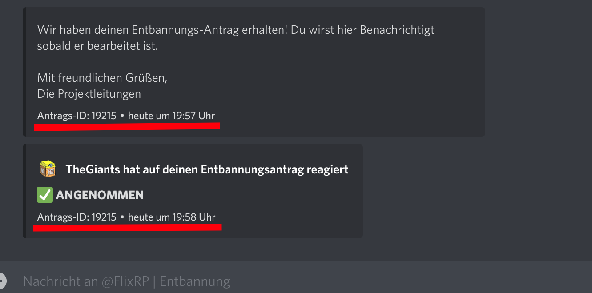

# Changelog

## 06.05.2022, 20:04

**Update: Bessere Verifizierung**

Wenn ein User bisher ein screenshot von der Angenommenen Nachricht vom Entbannnungsbot geschickt haben, musste man machmal fragen mit welchem account er es geschickt hat wenn man Nachschauen wollte ob der Screenshot echt ist und ob er wirklich angenommen wurde.

Neu ist das der Entbannungsbot jetzt in der nachricht die ID vom entbannungsantrag und die Uhrzeit mit sendet (siehe bild).

Man kann nun diese Antrags-ID hier https://verwaltung.flixrp.net/admin/index.php?controller=archive&action=search eintippen und somit quasi immer die screens von den leuten "verifizieren". Somit könnt ihr sicherstellen das die user keine gefälschten screenshots verschicken in hoffnung sie werden einfach entbannt obwohl sie abgelehnt worden sind.

Ist in der vergangenheit schon ein paar mal passiert deshalb diese neuerung.

## 11.03.2022, 17:33

Neue Funktion für alle :partying_face:
Eine automatische Suchfunktion die intern sucht ob der vom user eingegebene steamname oder TxAdmin ID schon einmal von anderen accounts eingegeben wurde (beispiel Siehe bild).
Das wird derzeit aus performance gründen aber nur auf der Seite angezeigt auf dem die unbeantworteten Entbannungsanträge aufgelistet sind.
PS: Mit **/userinfo** könnt ihr prüfen ob jemand gebannt ist!
Wenn da jemand noch was fehlt einfach bei mir melden :smile:

