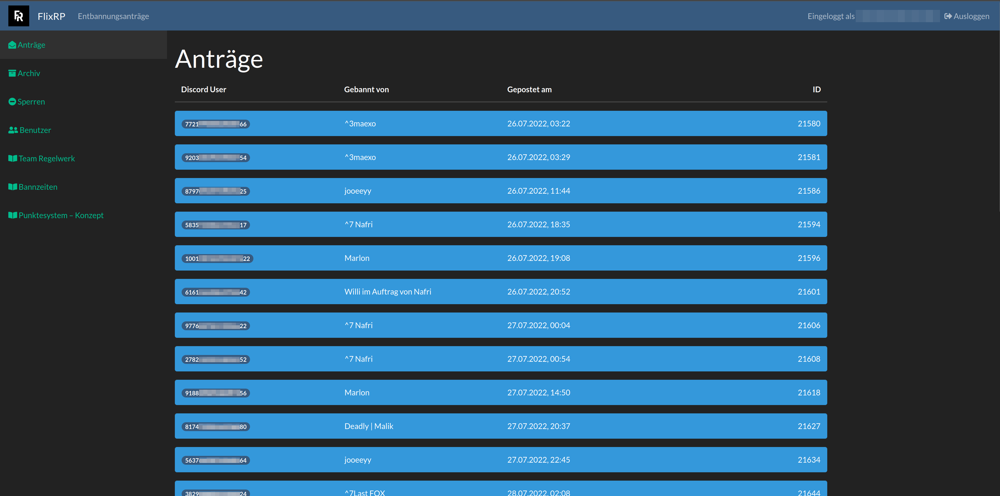
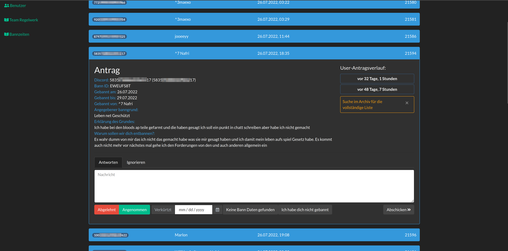
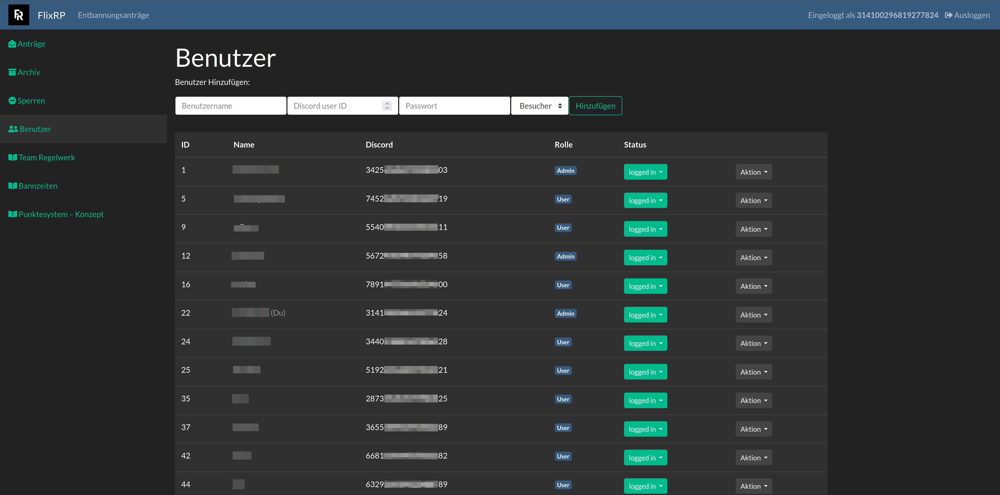
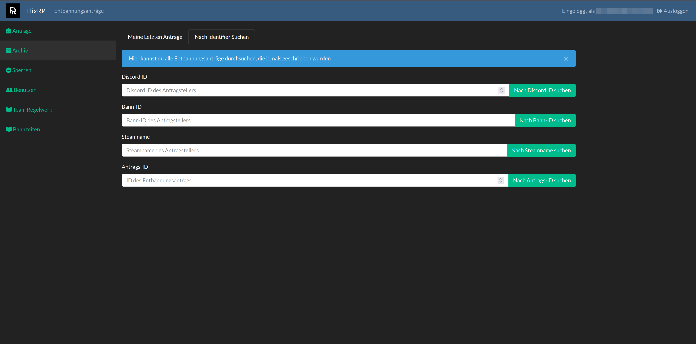
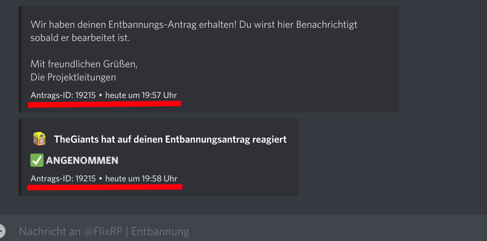
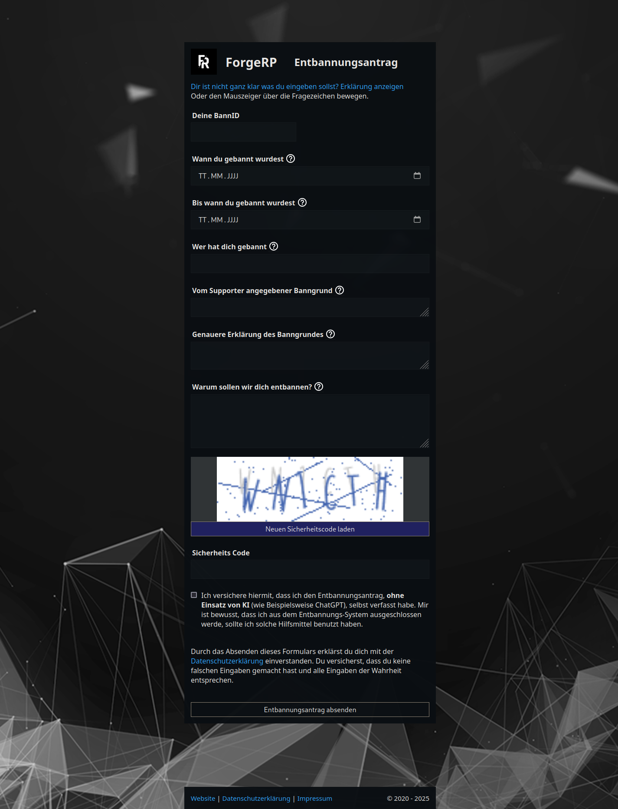
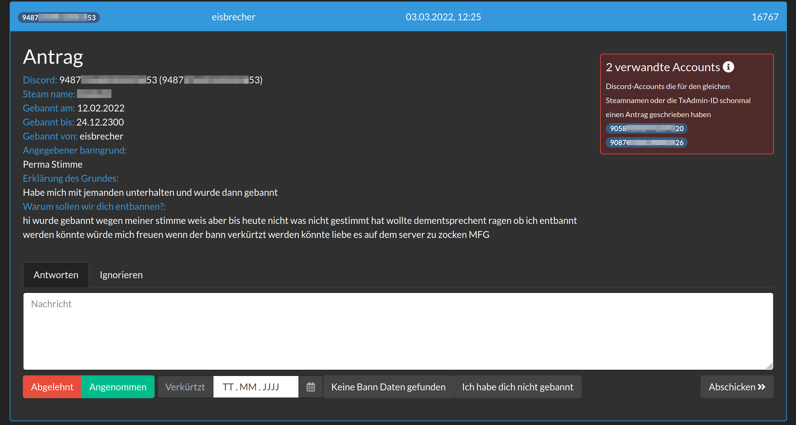

# FlixRP Entbannungssystem

Webinterface zur Verwaltung von Entbindungsgesuchen inkl. Discord-Bot zur Generierung von Einladungs-URLs.
Programmiert mit dem MVC-Entwurfsmuster in PHP. Der Discord-Bot ist in Python geschrieben. Gespeichert werden die Entbannungsanträge in einer JSON-Datei.

Projekt wird nicht mehr verwendet und ist inzwischen abgelöst von [Cordactyl](https://cordactyl.com).

### Referenzen

Struktur des Projekts basier auf dem Buch "Objektorientiertes PHP: Grundlagen der OOP" von Jan Teriete.

### Haftungsausschluss

Einige Teile des Codes wurden entfernt oder ersetzt. Dieses Projekt zielt nicht darauf ab, 1:1 Kopien der Website lauffähig zu machen, sondern dient nur historischen Zwecken.

Die Code-Basis ist sehr veraltet und es wird nicht empfohlen, diese produktiv einzusetzen!

## Preview

## Requirements

- PHP version 7.3
- Python